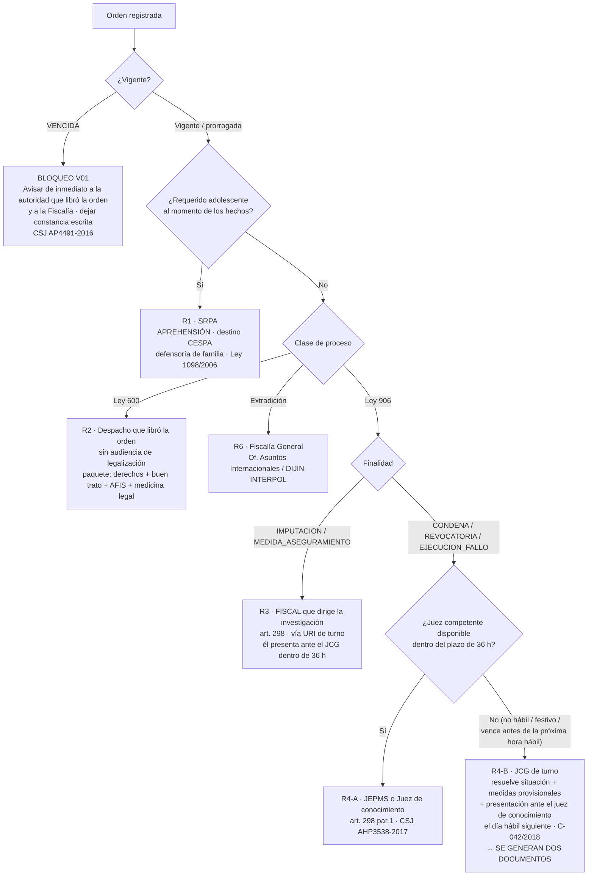

# FASE I — Módulo de Captura por Orden Judicial (rediseño completo)

> **Estado: IMPLEMENTADO (2026-07-28).** El resumen de lo que quedó construido está en `CLAUDE.md`,
> sección *Módulo "Captura por Orden Judicial"*. Regresión: `verify_oj.mjs` (85 checks).
>
> **Diferencias frente al plan de este documento** (vienen de la especificación posterior y del
> documento `Documentos/Propuesta Plantilla OJ.docx`):
> - **Un solo documento**, no dos plantillas embebidas (`TPL_OJ_FISCALIA`/`TPL_OJ_JUZGADO`): el
>   oficio es único y el destinatario es un dato. El motor de decisión del § 5 sí se implementó, pero
>   **propone destinatario**, no juegos de documentos distintos.
> - **El cuerpo no sale de una plantilla tokenizada** (§ 7): lo construye la app en OOXML y la
>   plantilla del usuario aporta únicamente membrete, pie, logos y márgenes. Esto hace innecesario el
>   catálogo de ~70 tokens y el validador de cobertura, y elimina la clase de fallo "token sin dato →
>   `{{NUM_ORDEN}}` impreso en un documento que va a un juzgado".
> - **7 pasos** en vez de 8: Revisión y Puesta a disposición se fundieron en el paso final.
> - La **plantilla base no embebe ningún `.docx`**: se arma desde cero (~80 KB) y por eso no hay nada
>   que "limpiar" de una captura de muestra.
>
> El análisis jurídico (§ 1 a § 6) se conserva íntegro: es la fuente de las reglas R0–R6, de las
> validaciones V01–V25 y de las citas que imprime el documento.

---

## 0. Resumen ejecutivo (leer esto primero)

**El diagnóstico del encargo es correcto y el problema es más grave de lo que parece.** Hoy el flujo
"Orden Judicial" de LexCapture es el flujo de flagrancia con seis campos extra (`numOrden`,
`delitoOrden`, `juzgadoOrden`, `fechaOrden`, `autoridadSolicita`, `destinoOJ`) y dos banderas que
apagan víctimas y testigos (`wc.sinVictima=true; wc.sinTestigo=true`). Eso no es un módulo: es un
formulario de flagrancia con partes desconectadas.

**La raíz conceptual del error:** en flagrancia el policía documenta **un delito** que acaba de
presenciar; en orden judicial documenta **una diligencia de cumplimiento** de una decisión que otro
funcionario ya tomó. Son dos objetos de documentación distintos. De ahí se deriva todo lo demás:
en OJ no hay víctimas ni testigos del hecho (el hecho lo juzgó otro despacho, a veces hace años),
pero sí hay entidades que la flagrancia no tiene — la **orden**, el **proceso**, el **despacho**,
el **juez**, la **finalidad** y, sobre todo, la **vigencia**.

**Tres hallazgos que obligan a modificar la especificación** (detalle en la sección 1.8):

| # | Premisa de la especificación | Hallazgo |
|---|------------------------------|----------|
| **D1** | "Cualquier orden judicial → generar informe para Fiscalía **e** informe para Juzgado" | **Incorrecto.** El destinatario lo determina la ley según quién libró la orden y con qué finalidad. En captura para cumplir condena **no hay fiscal**: el capturado va ante el juez de ejecución de penas o el de conocimiento (art. 298 par. 1º CPP; CSJ AHP3538-2017; C-042/2018). Generar un informe a Fiscalía en ese caso no tiene fundamento legal. |
| **D2** | "no existe formato único obligatorio para OJ" | **Cierto, y por una razón más de fondo:** ni el juzgado ni la fiscalía exigen por norma un formato determinado para este informe — lo que exigen es **información completa**, y el documento va **con la sola firma del funcionario que informa**. No hay FPJ de captura por orden judicial (el FPJ-5 es **expresamente** de flagrancia). Lo que sí aplica es el **oficio institucional de la Policía Nacional**, que ya existe en `Documentos/` (`Dejando a Disposición FISCALIA.docx` y `… JUZGADO.docx`). |
| **D3** | (no contemplada) | **Falta la validación más importante del módulo: la vigencia de la orden.** La orden vence al año (art. 298, mod. Ley 1453/2011 art. 56). Capturar con orden vencida obliga a la libertad inmediata (CSJ AP4491-2016). La propia Corte Suprema dice, textualmente, que el problema es que **"no se ha implementado un sistema informático apropiado que advierta la fecha de vencimiento"**. Ese es, literalmente, el hueco que esta app puede tapar. |

**Recomendación documental:** como ninguna autoridad impone formato, **el requisito real es la
completitud de la información** — y ahí es donde la app aporta. Se adopta como cuerpo canónico la
**estructura del oficio institucional que ya usas** (los dos `.docx` de `Documentos/`), embebida como
plantilla base, y se mantiene intercambiable la **capa gráfica** (membrete, consecutivo, códigos TRD,
pie) porque eso sí varía entre estaciones. Hoy, sin plantilla activa subida, el flujo OJ **no produce
ningún documento** y deja al policía sin salida: eso se acaba.

**Qué NO hace la app** (confirmado contigo): no genera el **acta de derechos del capturado** — se
diligencia aparte y viaja como **anexo**; la app solo registra que se leyeron, con hora y lugar,
porque eso sí va en el relato del oficio y en la lista de anexos.

---

## 1. ENTREGABLE 1 — Informe jurídico

### 1.1 Marco constitucional

**Art. 28 C.P.** — *"Nadie puede ser molestado en su persona o familia, ni reducido a prisión o
arresto, ni detenido, ni su domicilio registrado, sino en virtud de mandamiento escrito de autoridad
judicial competente, con las formalidades legales y por motivo previamente definido en la ley. […]
La persona detenida preventivamente será puesta a disposición del juez competente dentro de las
treinta y seis (36) horas siguientes."*

De aquí salen los **cinco requisitos constitucionales** que el módulo debe poder verificar y dejar
documentados:

1. **Mandamiento escrito** — existe un documento físico/digital: la orden. La app debe registrarlo, no suponerlo.
2. **Autoridad judicial competente** — despacho identificable.
3. **Formalidades legales** — las del art. 298 CPP (§ 1.2).
4. **Motivo previamente definido en la ley** — la finalidad, que además define la ruta procesal.
5. **36 horas** — plazo constitucional, no un objetivo de gestión.

Complementan: **art. 29** (debido proceso), **art. 30** (habeas corpus, reglamentado por Ley
1095/2006), **art. 32** (flagrancia como única excepción a la reserva judicial).

**Consecuencia de diseño:** la reserva judicial significa que en OJ el juicio de mérito **ya se hizo**.
El policía no valora si hay delito; valora **identidad** y **vigencia**. Todo el módulo debe estar
construido alrededor de esas dos verificaciones.

### 1.2 Ley 906 de 2004 (sistema acusatorio)

| Artículo | Contenido relevante |
|---|---|
| **295** | Afirmación de la libertad: las normas que restringen la libertad son de interpretación **restrictiva**. |
| **296** | Finalidad de la restricción: comparecencia, preservación de la prueba, protección de la comunidad y de las víctimas. |
| **297** | *Requisitos generales.* Orden escrita del **juez de control de garantías (JCG)**, a solicitud del **fiscal**, por motivos razonablemente fundados (art. 221). **Capturada la persona, se pone a disposición del JCG en máximo 36 horas** para audiencia de control de legalidad, cancelación de la orden y lo demás pertinente. Parágrafos (Ley 1453/2011 art. 55): el término **se interrumpe cuando el juez instala la audiencia**; el fiscal puede pedir en la misma audiencia la legalización de actos concomitantes; regla especial con tres o más capturados. |
| **298** (mod. **Ley 1453/2011 art. 56**) | *Contenido y vigencia.* El mandamiento indica **de forma clara y sucinta**: (a) motivos de la captura, (b) nombre y datos que permitan **individualizar** al indiciado o imputado, (c) el **delito**, (d) la **fecha de los hechos**, (e) el **fiscal que dirige la investigación**. **Vigencia máxima: un (1) año**, prorrogable tantas veces como sea necesario a petición del fiscal, quien **debe comunicar la prórroga a la Policía Judicial**. La divulgación por medios de comunicación fue declarada **exequible condicionada** (C-276/2019: exige autorización judicial previa). **Parágrafo 1º:** el capturado va ante el JCG en 36 h, **salvo cuando la captura es para el cumplimiento de la sentencia**, caso en el cual queda a disposición del **juez de conocimiento que profirió la sentencia** — norma **exequible condicionada** por **C-042/2018** (§ 1.4). |
| **300** | Captura excepcional del Fiscal General. El texto original fue declarado inexequible (C-1001/2005); revivido con límites por Ley 1142/2007 art. 21 y declarado exequible salvo expresiones por **C-185/2008**. **No es orden judicial** → fuera del alcance del módulo, pero se documenta para acotar. |
| **301–302** | Flagrancia (referencia de contraste, § 2). En flagrancia hay **dos** controles: uno del **fiscal** (art. 302 inc. 4) y otro del **JCG** (inc. 5). |
| **303** | *Derechos del capturado.* Se le informa **inmediatamente**: (1) el hecho que se le atribuye, los motivos de la captura y **el funcionario que la ordenó**; (2) el derecho a indicar la persona a quien se comunique su aprehensión; (3) el derecho a guardar silencio y que sus manifestaciones pueden usarse en su contra; (4) el derecho a designar y entrevistarse con abogado de confianza en el menor tiempo posible. Si no puede designarlo, lo provee la Defensoría Pública. |
| **38 núm. 1** | Competencia del **Juez de Ejecución de Penas y Medidas de Seguridad (JEPMS)**. |
| **450** | *Acusado no privado de la libertad.* Al anunciar el sentido del fallo condenatorio el juez puede disponer que siga en libertad o, si la detención es necesaria, **librar inmediatamente la orden de encarcelamiento**. Exequible: C-342/2017. **SU-220/2024** exige **motivación reforzada e individualizada** (no fórmulas genéricas) para la captura inmediata. |
| **459** | *Ejecución de sentencias.* La ejecución corresponde a las autoridades penitenciarias bajo supervisión y control del **INPEC**, en coordinación con el **JEPMS**. |
| **509** | *Captura con fines de extradición.* La decreta el **Fiscal General** — trámite administrativo, **no orden judicial**; exequible por C-243/2009 pese a no tener control de legalidad. |

### 1.3 Ley 600 de 2000 (procesos por hechos anteriores al 1º de enero de 2005 y aforados)

- Rige por hechos **anteriores al 1º de enero de 2005** (art. 528 Ley 906) y para aforados ante la CSJ.
- **Art. 350**: la orden de captura debe contener los datos necesarios para la **identificación o
  individualización** del imputado y el **motivo** de la captura.
- **Diferencia estructural**: no hay juez de control de garantías ni audiencia de legalización. La
  **primera orden de captura es competencia de la Fiscalía** (arts. 336, 339 y 350). El capturado se
  pone a disposición del **despacho que libró la orden**.
- La Rama Judicial mantiene un trámite específico para estos casos (Oficina de Apoyo Paloquemao), y
  exige un paquete documental concreto que confirma qué acompaña físicamente al capturado:
  **formato AFIS (Fiscalía), fotocélula (SIJIN), formato de derechos del capturado (Policía Nacional),
  acta de buen trato (Policía Nacional) y valoración de medicina legal (o constancia de renuencia).**
  → Ese paquete es la mejor evidencia disponible de **qué documentos debe poder producir/registrar el módulo**.

### 1.4 Jurisprudencia determinante

**⭐ C-042 de 2018 (Corte Constitucional)** — sobre el parágrafo 1º del art. 298 (captura para cumplir
sentencia). Declara la norma **EXEQUIBLE CONDICIONADA**: *"el capturado deberá ponerse a disposición
del juez de conocimiento o en su defecto ante el juez de control de garantías, dentro de las treinta
y seis (36) horas"*. Y si el control lo asume el JCG, **ese funcionario resuelve sobre la situación
del condenado, adopta medidas provisionales de protección y ordena la presentación de la persona,
con las diligencias, ante el juez de conocimiento que profirió la sentencia, al día hábil siguiente**.

> Esta sentencia resuelve **exactamente** la pregunta del encargo ("¿qué pasa si el juzgado no está
> disponible?"). No hay que inventar nada: la regla está fijada y es la que se implementa.

**⭐ CSJ AHP3538-2017, rad. 50400 (2 jun. 2017)** — captura para cumplir condena: la norma excluye el
asunto del ámbito del juez de garantías; el control corresponde al **Juez de Ejecución de Penas o, en
su defecto, al Juez de Conocimiento** (art. 38 núm. 1), **sin que sea preciso realizar audiencia
preliminar** dentro de las 36 horas. Razón: agotado el proceso y derruida la presunción de inocencia,
la inmediatez "palidece ante la potestad sancionatoria del Estado".

> **Tensión y regla aplicable:** C-042/2018 es **posterior** y es control abstracto con efectos
> *erga omnes*. Regla vigente combinada: **el término de 36 horas se mantiene siempre**; el
> destinatario primario es **JEPMS / juez de conocimiento**; el **JCG es la vía subsidiaria** cuando
> aquellos no estén disponibles, y su intervención no reemplaza la comparecencia ante el juez de
> conocimiento, que se ordena para el **día hábil siguiente**.

**⭐ CSJ AP4491-2016, rad. 47830 (13 jul. 2016)** — orden vencida:
- El control del fiscal **no se limita a la flagrancia**: cubre también la captura hecha **en
  cumplimiento de un mandato judicial que ya perdió vigencia** → procede la libertad, sin desgastar
  al juez de garantías.
- Antes de la Ley 1453/2011 la vigencia era de **6 meses**; hoy es de **1 año**.
- **Cita textual que justifica este módulo:** *"no se ha implementado un sistema informático apropiado
  que advierta la fecha de vencimiento […] eso puede causar el otorgamiento injusto de la libertad a
  peligrosos delincuentes"*.
- Si la orden está vencida y persisten los motivos, la Corte remite al inciso final del **art. 62 del
  Código Nacional de Policía (Decreto 1355/1970)**: la policía puede disponer hasta **24 horas** para
  la plena identificación y comprobar otras solicitudes de captura, **dando aviso inmediato a la
  autoridad que solicitó la captura**; en ese lapso el fiscal puede pedir prórroga o nueva orden.
  **C-024/1994** precisó que esas 24 horas están **comprendidas dentro de las 36**.
  > ⚠️ **Advertencia de vigencia normativa:** el Decreto 1355/1970 fue sustituido por la **Ley 1801 de
  > 2016** (Código Nacional de Seguridad y Convivencia Ciudadana), posterior a este auto. **Antes de
  > implementar el texto del "aviso por orden vencida" hay que verificar el fundamento actual.** La
  > obligación operativa que sí es indiscutible y la que la app debe reflejar es: **avisar de
  > inmediato a la autoridad que libró la orden y a la Fiscalía, y dejar constancia escrita.**

**CSJ AP rad. 29904 (12 jun. 2008)** — **cualquier** juez de control de garantías es competente para
legalizar la captura, con independencia del lugar del delito o de la captura; el criterio preferente
es el del **lugar donde está recluido** el capturado; existen **jueces de garantías ambulantes**
(art. 39). → El módulo **no debe** exigir un JCG "territorialmente correcto": debe permitir registrar
el JCG disponible/de turno.

**CSJ SP rad. 36107 (14 sep. 2011)** — el control de legalidad del capturado **en flagrancia** es más
exigente que el del capturado **por orden judicial** (en contenido, tiempo y número de controles),
porque en la orden ya hubo un análisis judicial previo de autoría o participación.

**C-276 de 2019** — divulgación de órdenes de captura por medios de comunicación: exequible **solo con
autorización judicial previa**. → El módulo **no debe** ofrecer ninguna función de difusión/publicación
de datos de la orden ni del requerido.

**SU-220 de 2024** — captura ordenada al anunciar el sentido del fallo (art. 450): exige motivación
reforzada; el juez no viola congruencia si aplaza la captura a la sentencia escrita. → Es una
finalidad distinta de "cumplir condena ejecutoriada" y debe modelarse aparte.

**C-243 de 2009** — la orden de captura con fines de extradición (art. 509) no requiere control de
legalidad; es trámite administrativo del Fiscal General.

### 1.5 Sistema de Responsabilidad Penal para Adolescentes (Ley 1098 de 2006)

Si el requerido tenía entre 14 y 18 años al momento de los hechos, rige el **SRPA**: se aplica la
Ley 906 **salvo en lo contrario al interés superior del adolescente**, con autoridades y terminología
propias (**aprehensión**, no captura; CESPA; defensoría de familia). El módulo debe **detectar la
edad y bifurcar**, exactamente como ya hace la app entre URI y CESPA en flagrancia.

> ⚠️ Punto a validar contigo con un caso real antes de implementar: **la frecuencia real de órdenes
> judiciales contra adolescentes en tu unidad**. Si es marginal, la Fase I entrega la bifurcación de
> terminología y destino (CESPA) y deja el resto del SRPA-OJ para una fase posterior.

### 1.6 Ejecución de la pena

**Ley 65 de 1993** (modificada por Ley 1709 de 2014) — Código Penitenciario y Carcelario: la reclusión
se materializa con **boleta de encarcelamiento** y **remisión** a establecimiento del INPEC, bajo
vigilancia del **JEPMS** (art. 38 núm. 1 CPP y art. 459 CPP). → En la rama de condena, el resultado
operativo del turno no es "una audiencia" sino **la entrega del capturado al establecimiento
carcelario con la orden del juez**. El documento debe estar redactado para ese fin.

### 1.7 Identificadores: precisión necesaria

- El **NUNC** (Número Único de Noticia Criminal) del SPOA tiene **21 dígitos**: departamento (2, DANE)
  + municipio (3, DANE) + entidad receptora (2: 60 FGN-CTI, 61 Policía Nacional, 63 INPEC) + unidad (5)
  + año (4) + consecutivo (5).
- **Los 16 dígitos que valida la app son correctos y no se tocan.** El **consecutivo final (5 dígitos)
  lo asigna la Fiscalía cuando termina el procedimiento**, de modo que en un **informe de captura en
  flagrancia** ese espacio va necesariamente **en blanco**: el policía escribe los 16 dígitos que sí
  conoce. `validateNunc()` está bien como está.
- **En OJ es al revés:** el proceso ya existe, así que el radicado llega **completo, con sus 21
  dígitos**, transcrito de la orden — como en tus propias plantillas
  (`SPOA 0500160002062025-04471`). Por eso el campo `oj.proceso.radicado` **no reutiliza
  `validateNunc()`**: se guarda tal cual viene en la orden, sin validación de longitud.
- **El "No. de la Orden de Captura" (`002` en el documento adjunto) NO es un identificador único
  nacional**: es un consecutivo **del despacho**. La clave única real es
  **despacho + número de orden + radicado del proceso**. No se le puede aplicar ninguna validación de
  formato ni de longitud.

### 1.8 Discrepancias con la especificación recibida (obligatorio documentarlas)

| Id | Premisa | Fundamento del hallazgo | Modificación propuesta |
|---|---|---|---|
| **D1** | "Cualquier orden judicial → informe para Fiscalía **e** informe para Juzgado" | Art. 298 par. 1º CPP; **C-042/2018**; **CSJ AHP3538-2017**; art. 297 CPP. En condena no interviene fiscal; en orden del JCG a petición de fiscal, el destinatario natural es **el fiscal que dirige la investigación** (dato que la propia orden debe contener, art. 298), quien presenta al capturado ante el JCG. | Sustituir la regla fija por un **motor de decisión** (§ 5) que calcula **un destinatario primario** + **comunicaciones secundarias**. Se conserva la posibilidad de emitir ambos informes, pero como **decisión explícita del usuario**, no como automatismo. |
| **D2** | "no existe formato único obligatorio" | Confirmado: el **FPJ-5** es, por su propio título, *"Informe de la Policía de Vigilancia en casos de captura en flagrancia"*, y **no existe un FPJ para captura por orden judicial**. Ninguna norma faculta al juzgado o a la fiscalía para exigir un formato: exigen **información completa**, y el oficio va con **la sola firma del funcionario que informa**. | El estándar aplicable es el **oficio institucional de la Policía Nacional** ya en uso (`Documentos/`). El **FPJ-3 Informe Ejecutivo no aplica**: es para servidores con **competencia de policía judicial** y para reportar **actos urgentes** — no es este caso. |
| **D3** | (ausente) | Art. 298 CPP; **CSJ AP4491-2016**. | Añadir **validación dura de vigencia de la orden** con semáforo y bloqueo. Es la función de mayor valor jurídico del módulo. |
| **D4** | "número de orden" tratado como identificador | Es consecutivo por despacho (`002`). | Clave compuesta; sin validación de formato. |
| **D5** | Diseñar la estructura documental "de la orden de captura" | El formato adjunto es el **formato de la Rama Judicial** — documento de **entrada**, producido por el juzgado. | La app **no debe producir órdenes de captura**: debe **transcribirlas** y producir **informes de materialización**. (Producir un documento con apariencia de orden judicial sería, además, un riesgo grave.) |
| **D6** | "Motivo de la captura debe conservar íntegramente el texto" | Correcto y se acoge. | Campo `motivoTextual` de texto libre, **sin truncar, sin auto-formatear, sin plantilla**, transcrito literal y marcado como cita en el documento generado. |
| **D7** | Clasificación propuesta de tipos de orden | El formato oficial de la Rama trae tres casillas: **INDAGATORIA** (institución de **Ley 600**), **PARA CUMPLIR LA MEDIDA DE ASEGURAMIENTO**, **PARA CUMPLIR CONDENA**. | La clasificación del § 3 se amplía y se ancla a esas casillas + las finalidades legales, para que el policía marque **lo mismo que dice la orden que tiene en la mano**. |

---

## 2. ENTREGABLE 2 — Análisis comparativo: flagrancia vs. orden judicial

| Dimensión | Captura en flagrancia | Captura por orden judicial |
|---|---|---|
| **Qué se documenta** | **Un delito** presenciado | **Una diligencia de cumplimiento** de una decisión judicial |
| **Fundamento** | Art. 32 C.P.; arts. 301–302 CPP | Art. 28 C.P.; arts. 297–298 CPP (Ley 906) / art. 350 (Ley 600) |
| **Quién decide la privación** | El policía, en el momento | Un **juez**, antes (reserva judicial) |
| **Control judicial** | **Posterior** (dos filtros: fiscal art. 302 inc. 4 + JCG inc. 5) | **Previo** (la orden). El posterior es **menos exigente** (CSJ 36107) y **no existe** en captura para condena (AHP3538-2017) |
| **Documento de entrada** | Ninguno | **La orden de captura** (formato Rama Judicial) |
| **Formato oficial de salida** | **FPJ-5** (obligatorio, estandarizado por la Fiscalía) | **Ninguno impuesto**: oficio institucional de la Policía Nacional, firmado solo por quien informa. Lo exigible es la **completitud**, no la forma |
| **Radicado / NUNC** | 16 dígitos: el consecutivo lo asigna la Fiscalía **después** → va en blanco | 21 dígitos **completos**, transcritos de la orden (el proceso ya existe) |
| **Destinatario** | Fiscalía (URI de turno) / CESPA si adolescente | **Variable**: fiscal que dirige la investigación · juez de conocimiento · JEPMS · JCG de turno · despacho de Ley 600 |
| **Término** | 36 h, con la palabra **"inmediatamente"** (art. 302 inc. 4) | 36 h (art. 297; art. 298 par. 1º + C-042/2018) |
| **Riesgo jurídico dominante** | Que el hecho **no configure flagrancia** | Que la orden **esté vencida**, o que la persona **no sea la requerida** (homonimia) |
| **Verificación crítica del policía** | Configuración de la flagrancia | **Identidad plena + vigencia de la orden** |
| **Víctimas / testigos** | Elementos centrales (apartados 5 y 6 del FPJ-5) | **No aplican** al hecho: lo juzgó otro despacho, a veces años antes |
| **EMP / cadena de custodia** | Habitual (elementos del delito) | **Excepcional** (solo lo hallado en la diligencia; si es delictivo → caso de flagrancia **separado**) |
| **Narración** | Relato del **hecho punible** | Relato de la **materialización**: cómo se ubicó, cómo se individualizó, cómo se le informaron los derechos |
| **Datos del requerido** | Los que se logren en el sitio | Los que **trae la orden** (padres, alias, rasgos físicos, lugar de nacimiento, señales) — sirven precisamente para **confirmar identidad** |
| **Terminología menores** | Aprehensión / CESPA | Aprehensión / CESPA (igual) |
| **Resultado del turno** | Audiencias concentradas ante JCG | Audiencia ante JCG **o** entrega al establecimiento carcelario con boleta (condena) |

**Conclusión arquitectónica:** no comparten modelo de datos, ni validaciones, ni documentos, ni flujo.
Comparten **primitivas** (personas, perfiles, cifrado, motor .docx, envío) y **nada más**. Ese es
exactamente el corte que propone el entregable 3.

---

## 3. ENTREGABLE 3 — Arquitectura funcional del nuevo módulo

### 3.1 Principio rector

> **La orden manda. El motor propone. El usuario confirma. La app registra por qué.**

La app **nunca** decide sola el destino jurídico del capturado: calcula una propuesta fundamentada,
la muestra **con su fundamento legal citado**, permite corregirla, y **guarda la regla que se aplicó**
(`destino.reglaAplicada`) para que el documento sea trazable meses después.

### 3.2 Capas

```
┌──────────────────────────────────────────────────────────────┐
│ 1. CAPTURA        Wizard OJ (8 pasos, § 8) — independiente   │
│                   de STEPS_URI/STEPS_CESPA                    │
├──────────────────────────────────────────────────────────────┤
│ 2. VALIDACIÓN     Reglas duras (bloquean) / blandas (avisan) │
│                   incl. vigencia de la orden y reloj de 36 h │
├──────────────────────────────────────────────────────────────┤
│ 3. DECISIÓN       ojResolverDestino(caso) → destinatario      │
│                   primario + secundarios + regla + fundamento │
├──────────────────────────────────────────────────────────────┤
│ 4. DOCUMENTAL     Cuerpo canónico de 11 bloques → motor de   │
│                   tokens v2 → plantilla del usuario o base   │
├──────────────────────────────────────────────────────────────┤
│ 5. SALIDA         Descarga (primaria) · Compartir · Dossier  │
│                   — reutiliza la Capa 1/2 ya construida      │
└──────────────────────────────────────────────────────────────┘
```

### 3.3 Qué se reutiliza y qué no

**Se reutiliza sin tocar** (primitivas transversales ya probadas):
`_unzipBufAsync`, `_buildZip`, `normalizeXmlRuns`, `escapeXml`, `sinPuntos`, `escAttr`, `fullName`,
`calcAgeVal`, `DB` (cifrado AES-GCM, `lc_cases`/`lc_persons`/`lc_cfg`), el hub de salidas
(`abrirDossierCaso`), el sheet de envío (`_pregenShareDoc`, `_compartirDoc`, `_shareNativo`), el
sistema de perfiles y despachos, el diseño (tokens CSS v2, sin emojis en UI).

**No se reutiliza** (se construye propio):
`STEPS_OJ` actual, `collectStep` para OJ, `rStep1/2/3/6/7` en su rama OJ, `buildDocOJBlob`,
`genDocDisposicion`, `_dispNarr2`, las banderas `sinVictima`/`sinTestigo`, y los campos sueltos
`numOrden`/`delitoOrden`/`juzgadoOrden`/`fechaOrden`/`autoridadSolicita`/`destinoOJ`.

**Compatibilidad hacia atrás (obligatoria):** los casos OJ ya guardados no se pueden romper ni
perder. Estrategia: los registros nuevos llevan `ojv:2` y todo bajo `caso.oj`; los antiguos
(`ojv` ausente) se listan igual, se abren en **modo lectura** con su documento antiguo disponible, y
ofrecen un botón **"Completar al formato v2"** que precarga lo que ya existe en el wizard nuevo.
Ninguna migración automática destructiva.

### 3.4 Aislamiento respecto de flagrancia

Regla de implementación no negociable: **el módulo OJ no modifica ninguna función usada por
URI/CESPA**. La suite de regresión del FPJ-5 (`verify_multipersona.mjs`, `verify_envio_doc.mjs`) debe
seguir en verde **sin cambios en sus expectativas**. Si una función necesita ajustarse para OJ, se
extrae una variante nueva; no se le añaden `if(tipo==='OJ')` a las del FPJ-5.

---

## 4. ENTREGABLE 4 — Modelo de datos

Todo bajo `caso.oj`. Los campos marcados **◆** vienen transcritos de la orden; **▲** los produce la
diligencia; **●** los calcula la app.

```js
caso = {
  id, tipo:'OJ', ojv:2, createdAt, updatedAt, estado,   // BORRADOR|COMPLETO|ENTREGADO

  oj: {
    // ── 4.1 LA ORDEN ────────────────────────────────────────────────
    orden: {
      numero:'',                    // ◆ consecutivo del despacho ("002") — sin validar formato
      fechaExpedicion:'',           // ◆ ISO
      claseProceso:'LEY906',        // ◆ LEY906 | LEY600 | SRPA
      finalidad:'',                 // ◆ enum § 3 del entregable 5
      motivoTextual:'',             // ◆ TEXTO ÍNTEGRO de la orden, literal (D6)
      despachoADisposicion:'',      // ◆ "Sírvanse poner a disposición de este despacho a:"
      dirigidaA:[],                 // ◆ ['SIJIN','CTI','DIJIN','GAULA','POLICÍA NACIONAL']
      vigencia: {
        meses:12,                   // ● 12 (Ley 1453/2011); 6 si expedida antes de 2011-06-24
        hasta:'',                   // ● fechaExpedicion + vigencia + prórrogas
        prorrogas:[{fecha:'',hasta:'',oficio:''}],   // ◆
        estado:'VIGENTE'            // ● VIGENTE | POR_VENCER | VENCIDA | CANCELADA | SUSPENDIDA
      },
      verificacion: {               // ▲ constancia de que se comprobó antes de capturar
        sistema:'', fecha:'', hora:'', funcionario:'', resultado:'', observacion:''
      }
    },

    // ── 4.2 AUTORIDAD QUE LA LIBRÓ ──────────────────────────────────
    despacho: {
      tipo:'',                      // ◆ JCG | JUEZ_CONOCIMIENTO | JEPMS | FISCALIA_L600 | OTRO
      nombre:'',                    // ◆ "Juzgado Treinta y Seis Penal Municipal con Función de Conocimiento de Medellín"
      especialidad:'', municipio:'', departamento:'',
      direccion:'', telefono:'', correo:'',
      juez:{ nombre:'', cargo:'' }, // ◆ "MARÍA VERÓNICA CORREA OROZCO / Juez"
      fiscalDirige:{ nombre:'', unidad:'', correo:'', telefono:'' }  // ◆ art. 298 — clave para el destino
    },

    // ── 4.3 EL PROCESO ──────────────────────────────────────────────
    proceso: {
      radicado:'',                  // ◆ 21 dígitos, se guarda tal cual (sin validar 16)
      fechaHechos:'',               // ◆
      fechaDecision:'',             // ◆
      delitos:[{ nombre:'', articulo:'', inciso:'', numeral:'', codigo:'', agravado:false }], // ◆ N
      pena:{ descripcion:'', meses:null, accesorias:'' },   // ◆ solo si finalidad = condena
      observacionesProceso:''
    },

    // ── 4.4 EL REQUERIDO ────────────────────────────────────────────
    requerido: {
      personaId:'',                 // enlace a lc_persons (reutiliza el módulo de Personas)
      tipoDoc:'CC', numDoc:'', expedidoEn:{ departamento:'', municipio:'' },   // ◆
      priNom:'', segNom:'', priApe:'', segApe:'',                              // ◆
      fechaNac:'', edad:null, sexo:'', nacionalidad:'',                        // ◆
      alias:'', profesion:'',                                                  // ◆
      residencia:{ direccion:'', barrio:'', sector:'', municipio:'', departamento:'', telefono:'' }, // ◆
      lugarNacimiento:{ pais:'', departamento:'', municipio:'' },              // ◆
      padres:{ madre:{nombres:'',apellidos:''}, padre:{nombres:'',apellidos:''} }, // ◆
      rasgos:{ estatura:'', colorPiel:'', contextura:'', otras:'' },           // ◆
      condiciones:{ sordo:false, ciego:false, mudo:false, discapacidad:'',
                    gestante:false, extranjero:false, comunidadEtnica:'',
                    requiereInterprete:false },                                // ◆/▲
      esAdolescente:false,          // ● derivado de fechaNac vs fechaHechos → bifurca a SRPA/CESPA
      identidadConfirmada:{ metodo:'', observacion:'' }   // ▲ cotejo documento/reseña/AFIS
    },

    // ── 4.5 LA DILIGENCIA ───────────────────────────────────────────
    diligencia: {
      fecha:'', hora:'',            // ▲ arranca el reloj de 36 h
      lugar:{ direccion:'', barrio:'', municipio:'', departamento:'', coordenadas:'', tipoLugar:'' },
      unidad:'', patrulla:'', vehiculo:'',
      funcionarios:[{ grado:'', nombre:'', cedula:'', placa:'' }],   // ▲ N
      formaUbicacion:'',            // ▲ cómo se dio con la persona
      usoDeFuerza:{ hubo:false, descripcion:'' },
      lesiones:{ hubo:false, descripcion:'' },
      novedades:'', observaciones:''
    },

    // ── 4.6 DERECHOS Y ANEXOS (art. 303 CPP) ────────────────────────
    // La app NO genera el acta de derechos: solo registra la constancia que va en el relato
    // y la relaciona como anexo del oficio.
    garantias: {
      derechos:{ leidos:false, hora:'', lugar:'', observacion:'' },
      comunicacionA:{ nombre:'', parentesco:'', telefono:'', hora:'', seLogro:null },
      defensor:{ tipo:'', nombre:'', telefono:'' },       // CONFIANZA | PUBLICO | NO_DESIGNA
      anexos:[{ nombre:'', incluido:true }],              // acta de derechos · copia de la orden · …
      // opcionales según el caso:
      valoracionMedica:{ realizada:null, entidad:'', fecha:'', hora:'', renuencia:false },
      consular:{ aplica:false, consulado:'', avisado:null, hora:'' },
      defensoriaFamilia:{ aplica:false, nombre:'', hora:'' }   // SRPA
    },

    // ── 4.7 INCAUTACIONES (condicional) ─────────────────────────────
    incautaciones:[{ descripcion:'', cantidad:'', rotuloCadena:'', entregadoA:'',
                     generaCasoFlagrancia:false, casoVinculadoId:'' }],

    // ── 4.8 PUESTA A DISPOSICIÓN ────────────────────────────────────
    destino: {
      sugerido:{ tipo:'', nombre:'' },      // ● motor § 5
      confirmado:{ tipo:'', nombre:'', direccion:'', telefono:'', correo:'' },
      reglaAplicada:'',                     // ● 'R4-CONDENA-JUEZ-NO-DISPONIBLE'
      fundamento:'',                        // ● 'Art. 298 par.1 CPP; C-042/2018'
      motivoCambioManual:'',                // si el usuario corrige la sugerencia
      fechaHoraEntrega:'', recibe:{ nombre:'', cargo:'' },
      plazo:{ vence:'', horasRestantes:null, semaforo:'' }   // ● OK | ALERTA | URGENTE | VENCIDO
    },

    // ── 4.9 DOCUMENTOS GENERADOS ────────────────────────────────────
    documentos:[{ tipo:'', destinatario:'', plantillaId:'', archivo:'', fecha:'', consecutivo:'' }]
  }
}
```

**Notas de modelo**

- `victimas` y `testigos` **no existen** en OJ. Si en la diligencia aparece un delito nuevo, se crea un
  **caso de flagrancia separado** (`casoVinculadoId`) — no se contamina el informe de la orden.
- Los **capturados múltiples** en OJ son **casos separados**: cada orden es contra **una** persona, con
  su propia vigencia y su propia finalidad. (Diferencia deliberada con el FPJ-5 v3, donde varios
  capturados comparten un mismo hecho.) Si un operativo materializa varias órdenes, la app permitirá
  **"duplicar diligencia"** para no re-teclear lugar, hora y funcionarios.
- Los números de documento se guardan con `sinPuntos()`, como ya hace el resto de la app.

---

## 5. ENTREGABLE 5 — Flujo de decisiones

### 5.1 Clasificación de órdenes (entregable "Fase 3" del encargo)

Anclada a las casillas del formato oficial de la Rama **y** a las finalidades legales:

| Código | Finalidad | Quién la libra | Base |
|---|---|---|---|
| `IMPUTACION` | Comparecencia a formulación de imputación | JCG a petición del fiscal | 297–298 CPP |
| `MEDIDA_ASEGURAMIENTO` | Cumplir medida de aseguramiento *(casilla del formato)* | JCG | 297–298, 306 y ss. |
| `CONDENA` | Cumplir condena ejecutoriada *(casilla del formato)* | Juez de conocimiento / JEPMS | 298 par. 1º; 38.1; 459 |
| `EJECUCION_FALLO` | Captura al anunciar el sentido del fallo | Juez de conocimiento | 450 CPP; SU-220/2024 |
| `REVOCATORIA` | Revocatoria de subrogados / beneficios / domiciliaria incumplida | JEPMS (o juez de conocimiento) | 38.1 CPP; Ley 65/1993 |
| `INDAGATORIA` | Vinculación mediante indagatoria *(casilla del formato)* | Fiscalía | **Ley 600**, arts. 336, 339, 350 |
| `EXTRADICION` | Captura con fines de extradición | **Fiscal General** (acto administrativo) | 509 CPP; C-243/2009 |
| `OTRA` | Cualquier otra prevista en la ley | — | se exige `motivoTextual` |

### 5.2 Árbol de decisión



### 5.3 Reglas, en texto

- **R0 · Vigencia (dura).** `hoy > orden.vigencia.hasta` → **bloqueo de generación**. La pantalla
  explica la consecuencia (procede la libertad, CSJ AP4491-2016) y ofrece: registrar prórroga,
  registrar el aviso a la autoridad que libró la orden, o marcar el caso como "orden vencida" para
  trazabilidad. **Semáforo**: VIGENTE (>30 d) · POR_VENCER (≤30 d) · VENCIDA.
- **R1 · SRPA.** Edad al momento de los **hechos** entre 14 y 18 → terminología **aprehensión**,
  destino **CESPA**, aviso a defensoría de familia. Menor de 14 → no es responsable penalmente:
  advertencia dura y ruta de protección (no se genera informe de captura).
- **R2 · Ley 600.** Destinatario: el **despacho que libró la orden**. No hay legalización ante JCG.
  Checklist documental de la Rama (derechos, buen trato, AFIS, fotocélula, medicina legal).
- **R3 · Ley 906, imputación o medida de aseguramiento.** Destinatario primario: **el fiscal que dirige
  la investigación** (art. 298), materialmente vía **URI de turno**; él presenta al capturado ante el
  **JCG** dentro de las 36 h (art. 297). Comunicación secundaria: **al despacho que libró la orden**,
  para su cancelación. **No se genera informe al juzgado** salvo que el usuario lo pida.
- **R4 · Ley 906, condena / revocatoria / art. 450.** Destinatario primario: **JEPMS o juez de
  conocimiento** que profirió la sentencia. **No hay fiscal → no se genera informe a Fiscalía.**
  - **R4-A** (juez disponible dentro del plazo): un solo informe, al juzgado.
  - **R4-B** (no disponible): **dos** documentos — informe al **JCG de turno** (que resuelve la
    situación y adopta medidas provisionales) **+** informe al **juez de conocimiento** para la
    presentación del **día hábil siguiente**, ambos citando C-042/2018.
- **R5 · Cualquier ruta:** siempre se calcula e imprime el **vencimiento exacto de las 36 h**
  (`captura + 36 h`) y siempre se deja constancia de la **hora y lugar de lectura de los derechos**
  (art. 303). El **acta de derechos no la genera la app**: se relaciona como **anexo**.
- **R6 · Extradición:** ruta propia con advertencia visible de que **no es una orden judicial** y de que
  no procede control de legalidad (C-243/2009).
- **R7 · Delito concurrente:** si en la diligencia aparece flagrancia, la app ofrece **crear un caso de
  flagrancia vinculado**; el informe de la orden **solo menciona** la existencia del caso, sin absorberlo.

### 5.4 Cálculo de "disponibilidad del despacho"

```
esHabil(fechaHora)  = díaSemana ∈ L..V  ∧  hora ∈ [horaIni, horaFin]  ∧  ¬esFestivoColombia(fecha)
vence36             = diligencia.fechaHora + 36 h
proximaHoraHabil    = primer instante hábil ≥ ahora
rutaCondena         = (esHabil(ahora) ∨ proximaHoraHabil < vence36) ? R4-A : R4-B
```

- Jornada hábil **configurable** en Ajustes (por defecto L–V 08:00–17:00).
- Calendario de **festivos de Colombia** calculado (Ley 51 de 1983, traslado al lunes siguiente), no
  una lista fija que caduque.
- El resultado se muestra siempre con su porqué: *"Sábado 22:15 · próxima hora hábil lunes 08:00 ·
  el plazo vence domingo 10:15 → ruta JCG de turno (C-042/2018)"*.

---

## 6. ENTREGABLE 6 — Propuesta de estandarización documental

### 6.1 El dato que cambia el análisis

**Ninguna autoridad impone formato.** No existe un FPJ de captura por orden judicial —el FPJ-5 se
titula *"Informe de la Policía de Vigilancia en casos de captura en flagrancia"*— y ni el juzgado ni
la fiscalía están facultados para exigir una estructura determinada: **lo que exigen es información
completa**. El oficio, además, **va con la sola firma del funcionario que informa** (no lleva revisión
ni visto bueno de la autoridad receptora).

> **Consecuencia:** el problema documental **no es de diseño gráfico, es de completitud**. Un informe
> bonito al que le falte la vigencia de la orden o la hora exacta de la captura es un informe malo;
> uno feo con todos los datos es válido. Por eso el esfuerzo de la app va al **checklist de
> completitud** (§ 5 y § 8), no a la estética.

**El FPJ-3 Informe Ejecutivo queda descartado:** es para servidores con **competencia de policía
judicial** y sirve para reportar **actos urgentes**. No es el caso de una captura por orden judicial
hecha por policía de vigilancia.

**El acta de derechos del capturado no la genera la app.** Se diligencia por fuera y viaja como
**anexo** del oficio. La app registra únicamente **que se leyeron, con hora y lugar**, porque ese dato
va en el relato y en la lista de anexos.

### 6.2 Decisión: las dos alternativas convergen

Las alternativas del encargo no son excluyentes, porque **la plantilla institucional que buscabas ya
existe y está en el proyecto**: `Documentos/Dejando a Disposición FISCALIA.docx` y
`Documentos/Dejando a Disposición JUZGADO.docx`. Son el oficio institucional de la Policía Nacional
(consecutivo `No. ___ / MEVAL – ESCAN – 1.10`, membrete, pie con `INFORMACIÓN PÚBLICA`, bloque
Elaboró/Revisó/Ubicación con código TRD).

**Decisión adoptada:**

1. **Cuerpo canónico = la estructura de esos dos oficios** (§ 6.3), no una estructura inventada.
2. **Ambos se embeben como plantilla base** (`TPL_OJ_FISCALIA`, `TPL_OJ_JUZGADO`), para que el módulo
   produzca documento **siempre**, aunque no se haya subido nada. Hoy, sin plantilla activa,
   `buildDocOJBlob` muestra *"Sin plantilla activa"* y **no genera nada**.
3. **La capa gráfica sigue siendo intercambiable** (Alternativa 2): membrete, logo, pie, consecutivo y
   códigos de dependencia/TRD varían por estación y van a **Ajustes**, no al código.

**Validación cruzada que confirma el motor de decisión del § 5:** tus dos plantillas ya reflejan,
sin haberlo formulado, la regla legal. La de **FISCALÍA** corresponde a una orden expedida por un
*"Juzgado Vigésimo Noveno Penal Municipal **con Función de Control de Garantías**"* → destino Fiscalía
(y cita el art. 298 CPP). La de **JUZGADO** corresponde a una orden de un *"Juzgado Treinta y Seis
Penal Municipal **de Conocimiento**"* → destino el juzgado. Es exactamente **R3 vs. R4**. El módulo
automatiza una distinción que ya aplicas a mano.

### 6.3 Cuerpo canónico — estructura del oficio (tomada de tus plantillas)

| # | Bloque | Contenido | Origen |
|---|---|---|---|
| 1 | Consecutivo y dependencia | `No. ___ / MEVAL – ESCAN – 1.10` | Plantilla · configurable |
| 2 | Ciudad y fecha | *Medellín, 25 de febrero de 2026* | Plantilla |
| 3 | Destinatario | `Señor(a)` + despacho (motor § 5) + dirección + ciudad | Plantilla |
| 4 | **Asunto** | *"Dejando a disposición capturado por orden judicial No. […]"* | Plantilla |
| 5 | **Tabla de identificación** | Nombres y Apellidos · Cédula · Fecha de nacimiento · Lugar de nacimiento · Padres · Estado civil · Ocupación u oficio · Dirección y teléfono | Plantilla (8 filas exactas) |
| 6 | **Relato ¶1 — abordaje** | Fecha, hora, funcionarios, lugar, actividad, registro a persona, resultado | Plantilla |
| 7 | **Relato ¶2 — verificación** | Traslado preventivo, consulta PDA/sistema, **orden No. X vigente**, delito, fecha de expedición, despacho, **SPOA** | Plantilla · **art. 298** |
| 8 | **Relato ¶3 — derechos** | Hora y lugar de lectura y materialización de los derechos (Ley 906/2004) | Plantilla · **art. 303** |
| 9 | **Relato ¶4 — identificación** *(condicional)* | Solo si no portaba documento: consulta Web Service / Policía Científica | Plantilla |
| 10 | **Relato ¶5 — destino** | Custodia en la estación **o** traslado a URI/despacho, con la autoridad concreta | Plantilla · § 5 |
| 11 | Firma | Grado, nombre, estación, dirección, celular, correo | Plantilla |
| 12 | **Anexos** | Informe · **Acta de derechos del capturado** · Copia de la orden de captura | Plantilla |
| 13 | Elaboró / Revisó / Fecha / Ubicación | Códigos TRD | Plantilla · configurable |
| 14 | Pie institucional | Dirección, teléfonos, correo, `www.policia.gov.co`, `INFORMACIÓN PÚBLICA` | Plantilla |

**Lo que el módulo añade a esa estructura** (son los datos que hoy quedan fuera y que constituyen el
valor jurídico del rediseño):

- En ¶2: **la vigencia de la orden calculada** ("expedida el 26/01/2026, vigente hasta el 26/01/2027")
  y la **constancia de verificación** (sistema, hora, resultado). Hoy el oficio dice "se corroboró que
  registraba orden vigente" sin decir **hasta cuándo**.
- En ¶5: **la hora exacta de vencimiento de las 36 horas** (art. 28 C.P.).
- En ¶5, ruta R4-B: el párrafo de **C-042/2018** cuando el juzgado no está disponible. *(Hoy tu
  plantilla de JUZGADO resuelve ese escenario diciendo que el capturado "quedó bajo custodia en la
  Estación… para cualquier requerimiento". Es una decisión tuya si quieres añadir la vía del juez de
  control de garantías de turno; el motor la propondrá y podrás descartarla.)*
- **Motivo textual de la orden (D6):** párrafo propio, entre comillas, precedido de *"La orden expresa
  textualmente:"*. Íntegro, sin resumir ni parafrasear.
- **Delitos, funcionarios y elementos como bloques repetibles** (hoy solo cabe uno de cada).

### 6.4 Diseño tipográfico

**No se rediseña nada.** La tipografía, los márgenes, el interlineado y la distribución ya están
resueltos en tus dos `.docx` y se **conservan intactos** — misma regla que se aplicó al FPJ-5:
*"diseño preservado 100 %; los cambios de datos no alteran la identidad visual"*. El motor solo
rellena; no toca estilos.

Solo se normalizan **dos convenciones de contenido**, porque tienen efecto jurídico:

| Parámetro | Valor | Fundamento |
|---|---|---|
| Fechas en el relato | `d de mmmm de aaaa` (*25 de febrero de 2026*) | Uso de tus plantillas |
| Fechas en datos y en la orden | `dd/mm/aaaa` (*26/01/2026*) | Uso de tus plantillas |
| **Horas** | **Siempre `hh:mm` en formato 24 h** | El plazo del art. 28 C.P. se cuenta en horas |
| Números de documento | Sin puntos (`sinPuntos()`) | Regla ya vigente en la app |

> Referencia de respaldo: **GTC 185 (ICONTEC, 2009)** para comunicaciones oficiales — solo se
> invocaría si algún día hay que construir una plantilla desde cero para una estación sin formato
> propio. Es guía técnica, no norma obligatoria, y **la plantilla del usuario siempre prevalece**.

---

## 7. ENTREGABLE 7 — Sistema de mapeo de plantillas

### 7.1 Qué falla hoy

`buildDocOJBlob` hace `xml.split('{{TOKEN}}').join(valor)` sobre 22 tokens. Problemas reales:

1. **Sin validación de plantilla:** si el `.docx` no trae los tokens, el documento sale vacío y nadie avisa.
2. **Token sin dato → queda `{{NUM_ORDEN}}` impreso** en un documento que va a un juzgado.
3. **Sin repetición ni condicionales:** no hay forma de imprimir N delitos, N funcionarios o N incautaciones.
4. **Sin plantilla base:** sin `.docx` subido, no hay documento (§ 6.1).
5. **Modelo plano:** los 22 tokens no alcanzan ni de lejos para el modelo del § 4.

### 7.2 Motor de tokens v2

**a) Catálogo declarativo** — cada token se define una vez, con su ruta al modelo, su formateador y
si es obligatorio:

```js
OJ_TOKENS = {
  'ORD_NUMERO':      { path:'oj.orden.numero',            req:true  },
  'ORD_FECHA':       { path:'oj.orden.fechaExpedicion',   fmt:'fechaLarga', req:true },
  'ORD_VIGENCIA':    { path:'oj.orden.vigencia.hasta',    fmt:'fechaLarga' },
  'ORD_MOTIVO':      { path:'oj.orden.motivoTextual',     fmt:'literal', req:true },
  'DESP_NOMBRE':     { path:'oj.despacho.nombre',         req:true },
  'REQ_NOMBRE':      { path:'oj.requerido',               fmt:'nombreCompleto', req:true },
  'REQ_DOC':         { path:'oj.requerido',               fmt:'tipoYnumeroDoc',  req:true },
  'DIL_VENCE36':     { path:'oj.destino.plazo.vence',     fmt:'fechaHora', req:true },
  'DEST_NOMBRE':     { path:'oj.destino.confirmado.nombre', req:true },
  'DEST_FUNDAMENTO': { path:'oj.destino.fundamento' },
  /* … ~70 tokens, uno por dato del modelo § 4 … */
}
```

**b) Bloques repetibles y condicionales**, resueltos **clonando nodos XML** (la técnica ya validada en
`_fpjRepetir`: `cloneNode(true)`, limpiar `w14:paraId`/`textId` y marcadores, insertar antes del
cierre) — **nunca** reconstruyendo el XML a mano:

```
{{#DELITOS}}  {{DELITO_NOMBRE}} — Art. {{DELITO_ARTICULO}} C.P.  {{/DELITOS}}
{{#FUNCIONARIOS}} {{FUNC_GRADO}} {{FUNC_NOMBRE}}, C.C. {{FUNC_CEDULA}} {{/FUNCIONARIOS}}
{{?INCAUTACIONES}} … bloque 8 … {{/?INCAUTACIONES}}
{{?ES_CONDENA}} … párrafo de remisión a establecimiento carcelario … {{/?ES_CONDENA}}
```

**c) Validación al subir la plantilla:** se extraen los tokens presentes y se muestra un informe —
*"Cobertura 61/70 · faltan: ORD_VIGENCIA, DIL_VENCE36 … · desconocidos: {{FECHA_XX}}"*. Los tokens
**obligatorios** faltantes impiden activar la plantilla, porque su ausencia produce un documento
legalmente incompleto.

**d) Token sin dato → cadena vacía + registro.** Nunca queda `{{…}}` visible. Al terminar, si faltaron
datos de campos obligatorios, se avisa por toast **antes** de entregar el archivo (misma política que
el FPJ-5 v3: *"en un documento legal, un dato que desaparece en silencio es el peor resultado"*).

**e) Plantilla base embebida** — `TPL_OJ_FISCALIA` y `TPL_OJ_JUZGADO`, generadas **a partir de tus
propios `.docx`** (`Documentos/Dejando a Disposición *.docx`) tokenizándolos: se sustituyen los datos
de la captura de muestra (SANTANDER VIDAL, Wesner Velásquez, Nelson David…) por tokens y se conserva
todo lo demás. En ZIP **stored** y validadas abriendo en **Word real** antes de embeberlas — regla ya
aprendida en FPJ-5 v2.1.
⚠️ Igual que en el FPJ-5: **toda celda o párrafo que el motor no sobrescriba filtrará el dato de
muestra**. El llenado será exhaustivo y el `verify_oj.mjs` incluirá el check de "cero rastros de la
persona de muestra".

**f) Reglas heredadas que se respetan:** rutas de zip normalizadas a `/`; `URL.revokeObjectURL`
diferido; nada asíncrono entre el tap y `share()`; verificación de alineación **midiendo el render**,
no leyendo el XML.

---

## 8. ENTREGABLE 8 — Estructura de los formularios

`STEPS_OJ = ['Orden','Proceso','Requerido','Diligencia','Garantías','Elementos','Disposición','Revisión']`

| # | Paso | Campos | Validación |
|---|---|---|---|
| 1 | **Orden judicial** | Número · fecha de expedición · clase de proceso · **finalidad** (las casillas del formato) · despacho emisor (tipo, nombre, especialidad, municipio, dirección, teléfono, correo) · juez · fiscal que dirige · dirigida a (SIJIN/CTI/…) · despacho a disposición · **motivo textual íntegro** · prórrogas · **verificación en sistema** | **V01 vigencia (dura)** · V02 número · V03 despacho · V04 finalidad |
| 2 | **Proceso y delitos** | Radicado · fecha de los hechos · fecha de decisión · delitos N (nombre, artículo, inciso, numeral, agravado) · pena (si condena) | V05 al menos un delito (blanda) · V06 radicado (blanda) |
| 3 | **Requerido** | Identidad completa · expedido en · nacimiento · sexo · nacionalidad · alias · profesión · residencia · lugar de nacimiento · padres · rasgos · señales · condiciones especiales · **cómo se confirmó la identidad** | **V07 identidad mínima (dura)** · **V08 adolescente → bifurca (dura)** · V09 confirmación de identidad (blanda fuerte) |
| 4 | **Diligencia** | Fecha · **hora** · lugar + coordenadas · unidad · patrulla · vehículo · funcionarios N · forma de ubicación · uso de la fuerza · lesiones · novedades | **V10 fecha y hora (dura — arranca el reloj)** · V11 al menos un funcionario |
| 5 | **Derechos y anexos** | Derechos leídos: **hora y lugar** · ¿portaba documento? → método de identificación (consulta Web Service / Policía Científica, ¶4 de tu plantilla) · comunicación a familiar · defensor · **anexos que acompañan el oficio** (acta de derechos, copia de la orden, …) · opcionales: valoración médica, consular, defensoría de familia | **V12 derechos leídos con hora (dura)** · V13 anexos marcados (blanda) |
| 6 | **Elementos** | ¿Hubo incautación? → N elementos con rótulo de cadena de custodia · ¿genera caso de flagrancia? | V14 rótulo si hay elemento (blanda fuerte) |
| 7 | **Puesta a disposición** | **Destino sugerido con su fundamento** (editable, exige motivo si se cambia) · disponibilidad del despacho · **reloj de 36 h** · datos de quien recibe | **V15 destino confirmado (dura)** · **V16 plazo vencido → alerta roja** |
| 8 | **Revisión** | Resumen · lista de validaciones · **documentos a generar según la ruta** · generar | Bloquea si hay validación dura pendiente |

**Principios de UX del wizard**

- El paso 1 se llena **con la orden en la mano**: el orden de los campos sigue el orden visual del
  formato de la Rama, para transcribir de arriba abajo sin saltar.
- Si el requerido ya existe en **Personas**, se precarga todo y solo se confirma.
- **"Duplicar diligencia"** para operativos con varias órdenes.
- El **reloj de 36 h** es visible desde el paso 4 en adelante (mismo componente que el badge de plazo
  legal de flagrancia, ya corregido en Fase H).
- **Sin emojis en la UI**, iconografía SVG stroke, tokens del Design System v2.

---

## 9. Plan de implementación (para ejecutar **después** de tu aprobación)

| Sub-fase | Alcance | Verificación |
|---|---|---|
| **I.1** | Modelo `caso.oj` v2 + migración no destructiva de casos OJ antiguos + `STEPS_OJ` nuevo y sus 8 paneles | Playwright: alta de caso OJ completo, recarga, persistencia cifrada; casos v1 siguen abriendo |
| **I.2** | `ojValidar()` (V01–V16), cálculo de vigencia, festivos de Colombia, reloj de 36 h, `ojResolverDestino()` | Tabla de casos: 8 finalidades × hábil/no hábil × Ley 600/906/SRPA, con la regla y el fundamento esperados |
| **I.3** | Motor de tokens v2 (catálogo, repetibles, condicionales, validador de plantilla) + tokenización y embebido de `TPL_OJ_FISCALIA` / `TPL_OJ_JUZGADO` desde tus `.docx` | Generar los `.docx` y **abrirlos en Word real** (COM); comparar el render contra el original; cero tokens residuales y cero rastros de la persona de muestra |
| **I.4** | Salidas: hub por caso, descarga, compartir; lista de anexos en el oficio | `verify_oj.mjs`; consola limpia; anti-caché `?v=31` / `cache-v31` |
| **I.5** | Regresión de flagrancia intacta | `verify_multipersona.mjs` (61 checks) y `verify_envio_doc.mjs` (37 checks) **sin modificar sus expectativas** |

**Riesgos declarados**

1. **Volumen del wizard.** 8 pasos con ~90 campos es mucho para un teléfono en campo. Mitigación:
   precarga desde Personas, campos opcionales colapsados, y guardado parcial en cada paso.
   *Si prefieres, se puede recortar a un "modo rápido" de 4 pasos con lo jurídicamente obligatorio.*
2. **Datos que solo trae la orden en papel.** Todo el paso 1 y 2 es transcripción manual. Una fase
   futura podría leer la orden por foto/OCR; **no** está en esta fase.
3. **Habeas Data.** El módulo maneja datos sensibles (incluidos adolescentes). Todo sigue **local y
   cifrado**; se mantiene la prohibición de cualquier función de difusión (C-276/2019).

---

## 10. Preguntas abiertas para ti (no bloquean la aprobación del diseño, sí la implementación fina)

1. **¿Qué finalidades ves realmente en tu unidad?** Si el 90 % son `CONDENA`, el wizard debe abrir
   por defecto en esa ruta y las demás quedan en segundo plano.
2. **¿Los dos `.docx` de `Documentos/` son la versión vigente de tu estación?** Si hay una más nueva
   (o de otro distrito), esa es la que se tokeniza.
3. **¿Órdenes contra adolescentes: pasa en tu unidad?** Define si SRPA-OJ entra en la Fase I o después.
4. **Jornada hábil de los juzgados de tu ciudad** (para el cálculo R4-A/R4-B): ¿L–V 08:00–17:00?
5. **Ruta R4-B (§ 6.3):** hoy, cuando el juzgado no está disponible, tu oficio dice que el capturado
   "quedó bajo custodia en la Estación". ¿Quieres que el módulo proponga además la vía del **juez de
   control de garantías de turno** (C-042/2018), o que se limite a reflejar lo que ya haces?

---

## 11. Fuentes

**Normativa** — Constitución Política (arts. 28, 29, 30, 32) · Ley 906 de 2004 (arts. 38, 295–303,
450, 459, 509, 528) · Ley 1142 de 2007 (art. 21) · Ley 1453 de 2011 (arts. 55, 56) · Ley 600 de 2000
(arts. 336, 339, 350) · Ley 1098 de 2006 (SRPA) · Ley 65 de 1993 y Ley 1709 de 2014 · Ley 1095 de 2006
· Ley 51 de 1983 · GTC 185 (ICONTEC, 2009).

**Jurisprudencia** — C-024/1994 · C-1001/2005 · C-185/2008 · C-243/2009 · C-342/2017 · **C-042/2018** ·
C-276/2019 · SU-220/2024 · **CSJ AHP3538-2017 rad. 50400** · **CSJ AP4491-2016 rad. 47830** ·
CSJ SP rad. 36107 (2011) · CSJ AP rad. 29904 (2008).

**Enlaces consultados**
- [Art. 297 CPP](https://leyes.co/codigo_de_procedimiento_penal/297.htm) · [Art. 298 CPP](https://leyes.co/codigo_de_procedimiento_penal/298.htm) · [Art. 303 CPP](https://leyes.co/codigo_de_procedimiento_penal/303.htm) · [Art. 450 CPP](https://leyes.co/codigo_de_procedimiento_penal/450.htm) · [Art. 509 CPP](https://leyes.co/codigo_de_procedimiento_penal/509.htm)
- [Sentencia C-042 de 2018](https://www.corteconstitucional.gov.co/relatoria/2018/C-042-18.htm) · [C-276 de 2019](https://www.corteconstitucional.gov.co/relatoria/2019/C-276-19.htm) · [SU-220 de 2024](https://www.corteconstitucional.gov.co/relatoria/2024/su220-24.htm) · [C-185 de 2008](https://www.corteconstitucional.gov.co/relatoria/2008/C-185-08.htm) · [C-243 de 2009](https://www.corteconstitucional.gov.co/relatoria/2009/c-243-09.htm)
- [CSJ — Control de legalidad de la captura (relatoría)](https://cortesuprema.gov.co/corte/wp-content/uploads/relatorias/pe/spa/CONTROL%20DE%20LEGALIDAD%20DE%20LA%20CAPTURA.pdf) · [CSJ — Juez de ejecución de penas, competencia](https://cortesuprema.gov.co/corte/wp-content/uploads/relatorias/pe/spa/DE%20EJECUCION%20DE%20PENAS%20COMPETENCIA.pdf)
- [Rama Judicial — P8-GSJ-00 Procedimiento capturas y libertades v05](https://www.ramajudicial.gov.co/documents/5454330/5661660/P8-GSJ-00+Procedimiento+Capturas+y+Libertades,%20tr%C3%A1mites+relacionados+con+la+situaci%C3%B3n+juridica+v05.pdf/9b6c6cb4-1f32-411a-8517-5fbe12226f50) · [Rama Judicial — disposición de capturados con orden vigente (Ley 600)](https://www.ramajudicial.gov.co/web/consejo-superior-de-la-judicatura/ventanilla-de-servicios/-/asset_publisher/TIpGpe2ENeIh/content/id/156593355)
- [Formatos de Policía Judicial (FPJ-1 a FPJ-43)](https://sites.google.com/cen.edu.co/investigacioncriminalesjim/formatos-de-polic%C3%ADa-judicial) · [FPJ-5 — Fiscalía](https://www.fiscalia.gov.co/colombia//wp-content/uploads/policiajudicial/MANUALPJ/FPJ-05%20INFOR%20POLIC%20VIGI%20EN%20FLAGRANCIA%20(1).doc)
- [GTC 185 — Manual de documentación organizacional](https://pascualbravo.edu.co/wp-content/uploads/2022/12/Manual-de-Documentacion-Organizacional-Norma-GTC-185-ICONTEC.pdf) · [Fiscalía — NUNC de 21 dígitos](https://www.fiscalia.gov.co/colombia/servicios-de-informacion-al-ciudadano/preguntas-frecuentes/)
